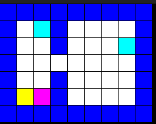

# So Long – Functional & Simplified

<figure>
  
  <figcaption>
  Blue tiles - walls<br>
  White tiles - walkable space<br>
  Yellow tile - exit<br>
  Cyan tiles - collectables
  </figcaption>
</figure>

## Overview


This project was developed overnight to assist a colleague in understanding and implementing the So Long project under extreme time constraints. The primary focus was on delivering a functional implementation of the core mechanics, with creative aspects minimized to meet the deadline.

The project includes essential features such as parsing, memory management, and game logic, which were deemed necessary to fulfill the minimum requirements. While some features like the move counter and scalable map size were omitted due to time constraints, they can be easily implemented later.

This project is not intended for submission and does not comply with Norminette requirements. Instead, it serves as a learning resource for 42 students who want a simplified yet functional reference for the So Long project.

## Features

### Core Game Mechanics:

- Map parsing and validation.

- Player movement and collision detection.

- Collectible items and exit conditions.

### Memory Management:

- Proper allocation and deallocation of resources.

- Prevention of memory leaks.

### Simplified Design:

- Focus on functionality over creativity.

- Easy-to-understand code structure for learning purposes.

## Missing Features (Easy to Implement)

- Move Counter: Track the number of moves made by the player.

- Scalable Map Size: Support for maps of varying sizes or dynamic scaling

- Enhanced Graphics: Improved visual elements for a more polished look.

## How to Use

### Clone the Repository:

```git clone https://github.com/Artur-2k/so_long```

### Install dependencies (Linux)

```sudo apt-get update && sudo apt-get install xorg libxext-dev zlib1g-dev libbsd-dev```


### Compile the Project:

```make all```

### Run the Game:

```./so_long map.ber```

Replace map.ber with the path to your desired map file.

**Note**: You'll have to build or find maps elsewhere ahah

### Contributions

While this project is primarily a learning resource, contributions are welcome! If you'd like to add missing features, improve the code, or fix bugs, feel free to open a pull request.
